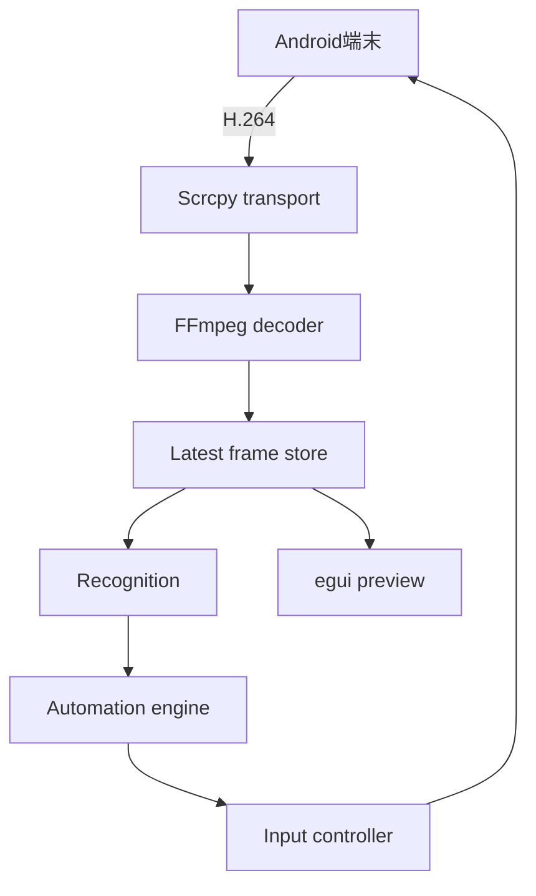
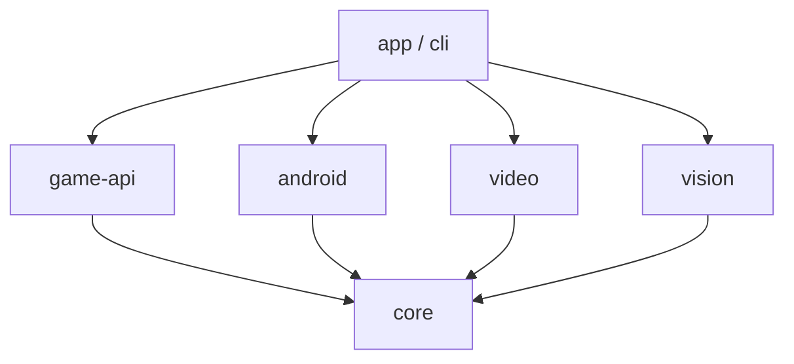
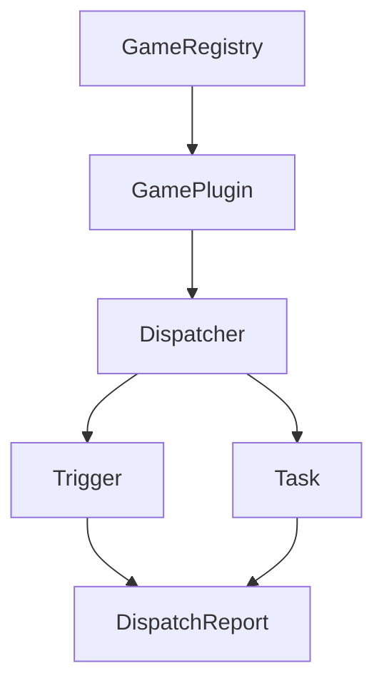

# アーキテクチャ

## 方針

映像はPCに表示されたscrcpyウィンドウを再キャプチャせず、Android上のscrcpy-serverから直接受信します。これによりOS固有の画面キャプチャ / DPI / ウィンドウ座標をCoreから除外します。

## crateの境界

| crate | 責務 | 依存してよいもの |
|---|---|---|
| better-e7-core | Frame / 座標 / ポート / 共通エラー | Rust標準ライブラリ |
| better-e7-config | TOML設定の読み書きと検証 | serde / toml |
| better-e7-automation | 汎用profile / Condition / Action / Rule engine | core / serde / toml |
| better-e7-adb | ADB process / 端末一覧 / 入力 | core / Rust標準ライブラリ |
| better-e7-runtime | Worker / command / event / 最新Frame / 入力queue / 認識worker / Rule実行 | config / core / automation / adb / video / vision / Tokio |
| better-e7-android | scrcpy-server起動 / transport / control | core / adb / Tokio |
| better-e7-video | ストリーム解析 / デコード / 色変換 | core / FFmpeg |
| better-e7-vision | 保存画像source / テンプレート / 将来の色 / OCR / ONNX | core / image / 将来のOpenCV / ort |
| better-e7-game-api | ゲーム登録 / 状態 / Trigger / Task / Dispatcher | core |
| better-e7-app | GUI / 構成 / 各処理の起動と停止 | 全公開crate / egui |
| better-e7-cli | ヘッドレス実行と検証 | GUI以外の公開crate |

現在はcore / config / automation / adb / android / video / vision / game-api / runtime / appを実装しています。開発の中心は汎用AutomationProfileとし、具体的なゲームcrateは汎用機能が不足した場合だけ追加します。

矢印と逆向きの依存は禁止します。特にcoreは外部ライブラリの具象型を公開しません。

## データモデル

`Frame`はデコード済みの画像を所有します。複数の利用者へ安価に渡すため、ピクセルバッファは`Arc<[u8]>`を使います。

座標は`NormalizedPoint`で表し、値域を0.0から1.0へ制限します。端末のピクセル座標への変換は入力直前に行います。認識範囲や矩形にも同じ正規化座標系を使います。

ゲーム側からruntimeへ渡す`InputCommand`は正規化座標を保持します。runtimeは最新Frameの幅と高さを使って`PixelInputCommand`へ変換し、ADB backendへ渡します。キー入力は画面サイズを必要としません。

## 並行処理

GUIスレッドではブロッキング処理を行いません。Tokio runtimeで端末監視 / 映像受信 / デコード / 自動化を動かし、境界では容量を制限したchannelを使います。

現在のruntimeはeguiからcommandを受け、ADB端末一覧 / 選択端末 / 自動化状態をeventとして返します。ADB processは`spawn_blocking`で実行するためGUIスレッドを止めません。

scrcpy sessionを開始すると、専用のblocking workerがvideo socketを読み続けます。停止flagは500msごとに確認でき、終了時はsocket / server process / ADB forwardの順に片付けます。H.264は外部FFmpeg processの標準入力へ送り、標準出力のPPM streamを`Frame`へ変換します。FFmpegの具象実装は`VideoDecoder`の内側に閉じ込め、将来FFI backendへ交換できるようにします。

デコード済みFrameはruntimeのlatest frame slotへ保存します。GUIが取得する前に次のFrameが届いた場合は古いFrameを置き換え、遅延やメモリ増加を防ぎます。eguiはRGB / RGBAをtextureへ変換し、縦横比を維持してpreviewへ表示します。

認識は映像workerと別のblocking workerで実行します。認識待ちのslotは1枚だけで、新しいFrameが届くと未処理の古いFrameを置き換えます。これにより認識が映像受信を止めず、結果が実画面から大きく遅れることも防ぎます。

最初の認識backendはpure RustのRGB template matcherです。正規化されたROI内を粗く探索し、最良候補の周辺を1pixel単位で再探索します。検出結果はlabel / confidence / center / boundsを持ち、egui previewへ正規化矩形として重ねます。OpenCVは複数templateや高度な処理が必要になった時点で、同じ`Recognizer`境界の内側へ追加します。

入力は容量64件の専用queueで順番に処理します。ADB commandは入力workerだけが実行するため、同時に複数の操作を送りません。停止時は新しい入力を拒否して未実行のqueueを破棄し、実行中のcommandが終了してからworkerを閉じます。

## ゲーム自動化

各ゲームは`GamePlugin`を実装し、安定した`GameId`と表示名を`GameRegistry`へ登録します。初期段階ではpluginをcompile時に組み込みます。動的downloadやnative libraryのloadは扱いません。

`Dispatcher`はゲームごとの`GameState` / `Trigger` / `Task`を所有します。各FrameのtickではTriggerをpriorityの高い順に評価し、`Consume`を返したTriggerでそのtickを終了します。これにより復旧用Triggerが通常Taskの更新をそのtickだけ抑止できます。

Taskは開始 / 更新 / 一時停止 / 再開 / 停止 / 完了の状態を持ちます。ゲーム側はADBへ直接入力せず、正規化座標の`InputIntent`を`DispatchReport`として返します。1回のtickで返せる入力は最大1件です。runtimeは次の縦切りでこの入力を既存の入力queueへ渡します。

## 汎用AutomationProfile

`better-e7-automation`はゲーム名を含まない宣言型profileを読み込みます。各RuleはCondition / Action / priority / cooldown / consumeを持ちます。Conditionは認識labelの有無を`all` / `any` / `not`で組み合わせられます。Actionは検出中心のtap / 固定座標のtap / swipe / Android key / logを扱います。

Ruleはpriorityの高い順に評価します。cooldown中のRuleと無効なRuleは飛ばします。入力Actionを1件生成した時点でtickを終了するため、同じFrameから複数の入力は生成しません。log Actionは`consume = false`にすると低priorityのRuleを続けて評価できます。

engineへ渡す時間は外部で管理します。単体テストでは任意の経過時間を渡せるため、待機やsleepを使わずcooldownを検証できます。runtimeはsession開始時刻からの単調増加時間を渡し、session開始ごとにcooldown状態をresetします。

profile内の複数templateは`RecognizerSet`へまとめます。認識workerが返した検出一覧をengineへ渡し、生成された入力を手動操作と同じ入力queueへ送ります。templateの相対pathはprofileのdirectoryを基準にするため、profileとassetを一緒に移動できます。GUIはprofile名 / 最後に実行したRule / log Actionをruntime eventとして受け取ります。

profileは停止中に読み直せます。新しいprofileのparse / validation / template読み込みがすべて成功してからrecognizerとengineを交換します。失敗時は実行中の設定を維持します。dry-runではengineまで同じ経路を通し、入力queueの直前で予定入力eventへ変換します。

録画の回帰確認には動画decoderを毎回動かさず、録画から抽出した画像pathを`ImageSequenceSource`へ渡します。Frame IDと順序を固定できるため、同じmatcher結果を通常CIで再現できます。

| 経路 | 方針 |
|---|---|
| デコードから認識 | 最新フレームを1枚だけ保持する |
| 認識からGUI | 最新の検出スナップショットを置き換える |
| Engineから入力 | 容量を制限した順序付きqueueを使う |
| Workerからログ | 非ブロッキングで送信する |

停止時はCancellationToken相当の共通信号を送ります。入力workerを先に停止し、その後で認識 / 映像 / transportを停止します。

## エラー処理

- 外部境界では原因を保持したエラーへ変換する
- GUIへは利用者向けの短い状態と再試行手段を返す
- ログには端末ID / frame ID / task名を含める
- panicは不変条件の破損に限定する
- 接続が失われた場合は入力queueを破棄する

## scrcpyとの互換性

scrcpyの内部プロトコルには互換性保証がありません。対応するscrcpy-serverをバージョン固定で同梱し、transport実装とセットで更新します。ライセンス表示 / ソース提供要件 / 配布方法は同梱前に確認します。

## セキュリティと安全性

- ユーザーが選択した端末だけを操作する
- 接続直後に自動操作を始めない
- GUIに常時見える停止操作を置く
- 外部から読み込む画像 / 設定 / モデルのパスを検証する
- ADB接続情報や端末情報を通常ログへ過剰に残さない
