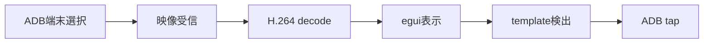

# 開発環境

## 必要なもの

- Rust 1.88以降
- rustfmt / Clippy
- Android Platform Tools
- 対応バージョンのscrcpy-server
- FFmpeg

FFmpegは映像プレビューの実行時に必要です。通常の単体テストは模擬PPM streamと生成画像を使うため、FFmpegやAndroid端末なしで実行できます。OpenCV / ONNX Runtimeは、それぞれが必要になった時点で追加します。

## 初回確認

```bash
rustup show
cargo fmt --all --check
cargo test -p better-e7-core
cargo run -p better-e7-app
```

ADBがPATHにない場合は`better-e7.toml`の`adb_path`を変更してください。書式は [configuration.md](configuration.md) にあります。

実機で映像接続を確認するときは、`third_party/scrcpy/README.md`に記載したscrcpy-server v4.1を配置します。通常の単体テストではserver binaryもAndroid端末も不要です。

FFmpegがPATHにない場合は`better-e7.toml`の`ffmpeg_path`を変更します。

template認識を試す場合は検出対象を切り出したPNGまたはJPEGを用意し、`recognition_template_path`へ設定します。しきい値は`recognition_threshold`で調整します。未指定の場合は認識を無効にしたまま起動できます。

## 実装の進め方

縦切りで動く範囲を増やします。最初の縦切りは次の流れです。



各段階では保存データを使う代替入力を用意し、Android端末がなくてもテストできるようにします。

実機では映像接続後にpreviewをclickすると、その位置をADB tapとして送ります。左panelのHome / Back / 上へswipeからキー入力とswipeも確認できます。停止操作の後は入力queueが閉じるため、新しい操作は送信されません。

## 外部依存を追加する基準

- Rustだけで保守できる実装が現実的か確認する
- 対象3OSの導入方法とCIでの扱いを確認する
- ライセンスと配布条件を確認する
- 外部型をcrateの公開APIへ漏らさない
- 採用理由と更新方針をADRへ追記する

## ブランチと変更

通常の作業はdevelopで進めます。必要に応じてdevelopから小さな機能branchを作り、完了後にdevelopへ戻します。リリース可能な状態になったらdevelopからmainへのPRを作ります。コミットにはコードと対応するテスト / 文書を含めます。

## ローカル制約

Android実機を使う結合テストは通常のCIから分けます。通常CIは保存フレーム / 模擬VideoSource / 模擬InputControllerを使い、決定的に実行できるテストだけを対象にします。

通常のpush / PRではUbuntuだけを使います。Windows / macOSのGitHub-hosted runnerは必要なときだけ`Cross-platform check`を手動実行します。特にmacOS runnerは通常CIへ追加しません。
