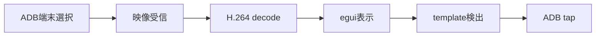

# 開発環境

## 必要なもの

- Rust 1.85以降
- rustfmt / Clippy
- Android Platform Tools
- 対応バージョンのscrcpy-server

FFmpeg / OpenCV / ONNX Runtimeは、それぞれを使うcrateへ着手するときに追加します。CoreとGUI骨格の開発には不要です。

## 初回確認

```bash
rustup show
cargo fmt --all --check
cargo test -p better-e7-core
cargo run -p better-e7-app
```

## 実装の進め方

縦切りで動く範囲を増やします。最初の縦切りは次の流れです。



各段階では保存データを使う代替入力を用意し、Android端末がなくてもテストできるようにします。

## 外部依存を追加する基準

- Rustだけで保守できる実装が現実的か確認する
- 対象3OSの導入方法とCIでの扱いを確認する
- ライセンスと配布条件を確認する
- 外部型をcrateの公開APIへ漏らさない
- 採用理由と更新方針をADRへ追記する

## ブランチと変更

小さな機能単位でbranchを作り、mainへのPRでCIを通します。コミットにはコードと対応するテスト / 文書を含めます。

## ローカル制約

Android実機を使う結合テストは通常のCIから分けます。通常CIは保存フレーム / 模擬VideoSource / 模擬InputControllerを使い、決定的に実行できるテストだけを対象にします。

