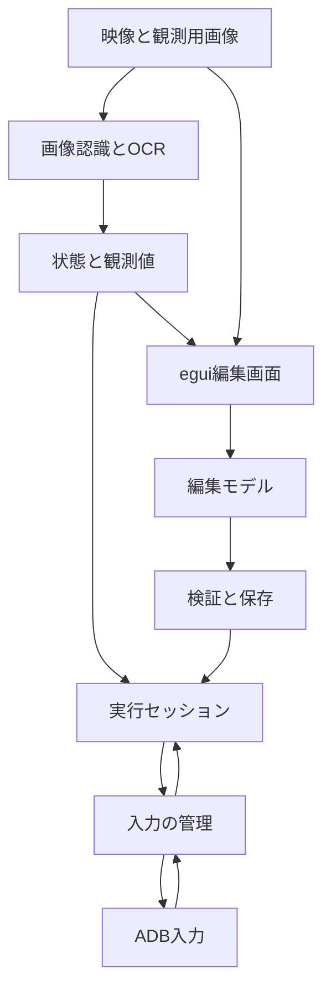
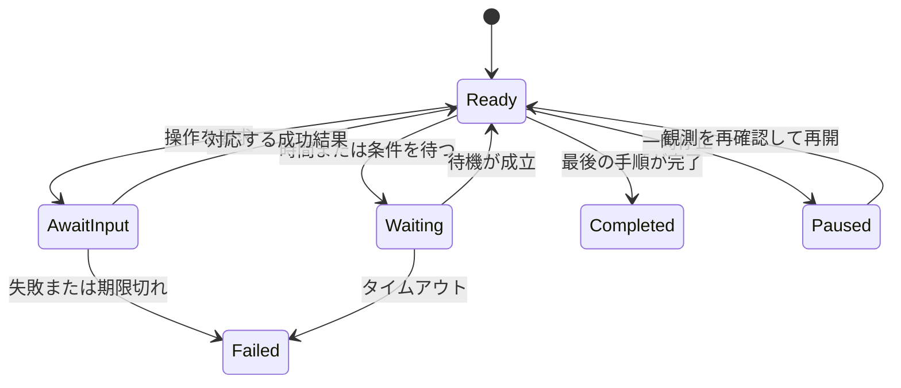

# タスク作成GUIの設計

状態: 実装前。[要件](requirements.md)と[データ形式](schema.md)に従って実装します。以下の新しい型名とAPI名は実装時の設計契約です。既に存在するAPIを示すものではありません。

## 採用方針

- 既存のRust / egui / eframeとscrcpy映像経路を拡張する。別のWebアプリやElectronアプリは作らない。
- 既存のRule engineは従来の意味のまま残し、順序付きタスクは専用のSequenceEngineで扱う。
- 実行する定義を1つだけ持ち、キャンバスとフォームは同じ編集モデルを更新する。
- 画面の状態、端末から読んだ値、タスクの変数を区別する。判定と入力はruntimeが管理する。
- 画像とOCRの結果を根拠付きのスナップショットへまとめる。古い結果や他端末の結果は採用しない。
- GUIスレッドではADB / OCR / 画像処理 / ファイルI/Oを実行しない。

## 構成と責務

| 配置 | 追加または変更する責務 |
|---|---|
| `better-e7-app/src/task_studio/` | canvas、手順一覧、状態グラフ、項目フォーム、記録確認、Undo / Redo |
| `better-e7-app/src/app.rs` | 既存プレビューとの共通化、接続と実行の分離、モード切り替え |
| `better-e7-app/src/profile_editor.rs` | 従来Ruleの編集を維持し、共有Draftへの変更操作へ接続 |
| `better-e7-automation/src/document.rs` | v1 / v2の読み書きと検証、移行 |
| `better-e7-automation/src/state_model.rs` | 状態定義、型付き観測値、StateEstimator、三値の条件評価 |
| `better-e7-automation/src/sequence.rs` | 手順進行、待機、分岐、繰り返し、変数、入力結果の照合 |
| `better-e7-game-api/src/model.rs` | 既存GameStateを宣言型セッションから更新する最小の公開API |
| `better-e7-runtime/src/studio.rs` | 接続 / 観測 / 実行の調停、編集内容の読み込み、記録 |
| `better-e7-runtime/src/project_store.rs` | 下書き、画像、原子的な保存、復旧 |
| `better-e7-runtime/src/input.rs` | ID付き入力queue、完了通知、停止、期限、排他 |
| `better-e7-core` | GUIに依存しない座標変換と観測用の共通型 |
| `better-e7-adb` | 入力座標系の取得、観測用スクリーンショット、期限付きprocess実行 |
| `better-e7-vision` | 原画像の切り出し、既存matcher、OCRの前処理と文字列の型変換 |
| `better-e7-ocr`を新設 | OcrBackendと外部Tesseract processの隔離、TSV結果の読み込み |

`automation -> game-api -> core`の依存を追加できます。game-apiからautomationへの逆向きの依存は追加しません。OCRの具象型はcoreやgame-apiへ公開しません。外部依存の判断は[ADR](../decisions/visual-task-studio.md)に記録します。

## 既存GameStateとの関係

`GameState`のcurrent / previous / revisionと`StateId`を再利用します。宣言型の実行セッションがGameStateを1つ所有し、StateEstimatorが確定した状態だけを反映します。

現状の`GameState::transition`はcrate内限定なので、同じ遷移処理を使う公開メソッド`apply_observed_state(StateId)`を追加します。状態の定義、認識条件、有効性の確認はautomation側で行います。Taskから観測状態へ直接代入するAPIは設けません。

`unknown`を予約状態とします。判定中 / 未検出 / 競合 / 期限切れの理由は、GameState自体を肥大化させず`StateEstimate`に保持します。状態条件はcurrent IDだけでなく、StateEstimateがvalidかどうかも確認します。

ゲーム別の既存Dispatcherはそのまま残します。初期実装では宣言型タスクとDispatcherを同時に動かしません。既存Dispatcherには時刻と入力完了の経路がないため、無理にSequenceEngineを既存Task traitへ押し込みません。後で接続する場合はruntimeの同じ排他と入力完了通知を使うadapterを追加します。

## 接続と実行の分離

接続状態は既存のDisconnected / Connecting / Connected / Disconnectingを使います。別に実行状態Idle / Running / Pausing / Paused / Stopping / Completed / Failedを持ちます。

| 操作 | 前提 | 結果 |
|---|---|---|
| 接続 | readyな端末を選択済み | 映像と観測を開始。実行はIdle |
| 編集内容を反映 | 実行Idleか終了済み、記録停止済み | 検証済みsnapshotへ交換。接続は維持 |
| タスク開始 | 最新の端末情報と有効な開始条件がある | 変数とタイマーを初期化してRunning |
| 一時停止 | Running | 追加入力を止め、処理中の結果を待ってPaused |
| 再開 | Paused、同じsessionとgeometry | 観測値を再確認してRunning |
| タスク停止 | 実行中 | 実行世代を失効し、未送信入力を破棄。映像は維持 |
| 切断 | 接続中 | 全入力を停止し、認識 / 映像 / transportを終了 |

既存の`StartAutomation` / `StopAutomation`の呼び出し箇所を洗い出し、接続操作と実行操作へ置き換えます。単にGUIのボタン名だけを変えてはいけません。従来Ruleも接続しただけでは動かさず、利用者がRule実行を開始した場合にだけ評価します。

入力の所有者を`None / Manual / Recording / Rules / Task / SingleStep`のいずれかに限定します。DryRunとOfflineは入力所有権を取得しません。GUIの無効化に加えruntimeでも確認し、旧SubmitInput経路からの割り込みも拒否します。

## コマンドとイベント

各非同期要求はrequest IDを持ちます。実行要求はsession ID、project revision、run IDも持ちます。これらは保存形式の状態IDとは別です。

| 新しいcommandの役割 | 主な入力 | 完了event |
|---|---|---|
| ConnectDevice / DisconnectDevice | serial / session ID | ConnectionChanged |
| ApplyDocument | document snapshot / revision | DocumentApplied / ValidationFailed |
| SetInteractionMode | mode / session ID | InteractionModeChanged |
| SaveProject / RecoverDraft | immutable draft / expected revision | ProjectSaved / SaveFailed |
| EvaluateFrame | reference frame / draft revision | ObservationEvaluated |
| StartRecording / StopRecording | task ID / revision | RecordedOperation / RecordingStopped |
| StartTask / TestStep | task ID / optional step ID / run mode | RunChanged / StepChanged |
| PauseTask / ResumeTask / StopTask | run ID | RunChanged |
| SubmitManualInput | operation ID / gesture / source frame | InputFinished |

非同期で返った保存結果は、その要求のrevisionを保存済みにするだけです。要求後に行われた編集のdirty状態を消してはいけません。長いOCR / 接続 / 保存をcoordinator内でawaitし続けず、別workerからの完了通知として受け取ります。

現在のcommand / event channelはunboundedです。新経路では制御commandを容量64、完了eventを容量256に制限し、混雑をエラーとして返します。映像 / 観測表示は最新snapshot用slotで上書きします。停止は通常commandの満杯に影響されない共有停止フラグと起床通知を持たせます。

## 座標と映像の対応

### 3つの座標系

| 座標 | 用途 |
|---|---|
| egui point | マウス、ズーム、パン、表示上のハンドル |
| 元Frameのpixel / 正規化座標 | 画像切り出し、ROI、タップ点の保存 |
| Androidの入力pixel | ADBが実際に操作する位置 |

キャンバスの実画像矩形をRとしたとき、ズームとパンを含む逆変換で`u = (pointer_x - R.left) / R.width`、`v = (pointer_y - R.top) / R.height`を求めます。egui pointへOSのDPI倍率をもう一度掛けません。Rの外の入力、幅や高さが0の表示、NaNは拒否します。

点の変換は既存`NormalizedPoint::to_pixels`の`round(u * (width - 1))`を使います。矩形の切り出しは既存`NormalizedRect::to_pixels`のfloor / ceilと半開区間を使います。点の式を矩形へ流用してはいけません。

`scrcpy_max_size`によって映像は入力先より小さくなります。現在の`queue_input`が最新FrameのサイズでADB座標へ変換する箇所を変更し、`DisplayGeometry`が持つ現在の論理入力サイズを使います。1920 x 1080の端末を960 x 540で表示した場合も、右下の点はADBの1919,1079へ対応させます。

### DisplayGeometryの契約

session ID / display ID / 入力幅と高さ / 回転 / stream幅と高さ / geometry revision / 取得時刻 / 検証状態を保持します。最初はAndroidのメインdisplay全体だけを対象にし、scrcpyのcrop / 映像だけの回転 / ミラー / 仮想displayは拒否します。

ADB側へDisplayGeometryProviderを追加します。メインdisplayの現在のlogical sizeとrotationを取得するadapterを作り、`dumpsys display`などの出力を対象Android版ごとのfixtureで検証します。`wm size`の物理解像度だけでは回転とoverrideを確定できないため、それだけを信用しません。取得できなければ映像と編集は使えますが、入力を伴う操作は開始できません。

接続時、実入力の直前、映像サイズ変更時にgeometryを検証します。端末回転やサイズ変更を検知したら実行を止め、ドラッグと未送信入力を失効させます。180度回転もサイズだけでは分からないためrotationを比較します。再取得と新しい参照画像の確認後に利用者が再開します。異なる形状へ既存の画像認識を自動で適応できるとは扱いません。

送信前のgeometry確認とAndroidが入力を処理する間の回転を完全には排除できません。初期の実機受入では端末の向きを固定して確認し、この制約を接続画面に短く表示します。

## Frameと観測の整合性

Frameの既存pixel bufferはArcで共有し、スクリーンショットをGPU textureから取り出しません。固定画面はsession ID / frame ID / geometry revision / source kindと元Frameを保持します。

`RecognitionSnapshot`へ同じ識別子、認識開始時刻、完了時刻、detection一覧を付けます。状態判定は同じFrameのdetection一覧だけで行います。画面のoverlayは対応するFrameで表示し、最新の別Frameへ古い矩形を無条件に重ねません。

OCRは項目ごとにsource frame ID、適用対象のscreen revision、値、raw text、品質、更新時刻を保持します。別session / 古いdocument revision / 既に変わった画面状態から遅れて返った値は捨てます。異なるFrameの項目を組み合わせる条件には有効期間と最大時刻差を適用し、最大時刻差の初期値は1000msとします。

### 静止画面と古い映像

scrcpyは画面が変わらないと新しいFrameを出さない場合があります。新しいFrameが来ないことだけで切断と判定してはいけません。一方、古い画像を繰り返し認識しても観測時刻を更新してはいけません。

入力前の条件確認やOCR更新に1000msより新しい画像が必要なのにstreamが更新されない場合は、選択端末の`adb exec-out screencap -p`で観測用画像を1枚取得します。これは端末情報の補助取得であり、映像プレビューはscrcpyを使い続けます。取得は最大1件、期限2秒とし、失敗すれば関連条件をunknownにして入力を保留します。単なる編集プレビューでは定期取得しません。

補助画像も同じDisplayGeometryで検証し、既存streamの認識サイズへ明示的に正規化して認識へ渡します。元の画像と変換情報は保持します。補助取得要求に観測世代を付け、古い補助取得結果や古いrevisionの認識結果は採用しません。

現状の`Frame::captured_at`はPPMを読み終わったPC時刻であり、端末で撮影した時刻ではありません。入力直後の条件待ちでは、入力完了後に要求した補助画像を最初の判定材料にし、単にdecode時刻が新しいだけで入力後の画面と断定しません。画像取得順と画面遷移の完了も別なので、その後は明示した条件が成立するまで待ちます。

初期実装では、実入力を伴うTask / SingleStepの状態と値の条件判定には補助画像の経路を使います。開始時に観測世代を切り替え、そのrun中はstream由来の遅着した認識結果で実行用モデルを上書きしません。観測更新は必要なときだけ最大500ms間隔で要求し、状態や値はこの同じ経路からGUIにも返します。scrcpyは引き続きライブ映像を表示します。これによりraw streamのdecode順だけで入力後の撮影を推測せずに済みますが、初期版の条件確認には画像取得の遅延が加わります。将来scrcpyの時刻metadataを使う場合は、撮影時刻と入力の順序を実証してからこの経路を置き換えます。

## 状態推定と値の品質

StateEstimatorはFrame単位で各画面状態の画像条件を評価します。最高優先度が一意で、その候補が2つ以上の異なる観測で300ms以上続いたとき確定します。安定時間は状態ごとに変更可能です。同じ固定Frameを何度評価しても観測回数へ加算しません。

候補が変わった時点で現在の状態をpendingにし、状態依存の新しい入力を止めます。無一致が500ms続けばunknownへ遷移します。同点はconflictとして扱い、優先度または条件の調整を案内します。GameStateのrevisionは確定したIDが変わった場合だけ増やし、品質変化は観測revisionで表します。

観測項目は`Valid(value) / Unknown(reason) / Stale(last_value)`を持ちます。初期の有効期間は2000msで、読取間隔以上であることを検証します。適用画面から離れた時点で値は無効になります。

PredicateはTrue / False / Unknownを返します。無効な値との比較はUnknownです。NOT UnknownもUnknownです。ANDはFalseがあればFalse、なければUnknownを伝播し、ORはTrueがあればTrue、なければUnknownを伝播します。Unknownをelse分岐や画像の不在として扱いません。条件待機はタイムアウトまで待ち、分岐も判定用の期限を持ちます。

状態遷移グラフは想定する移動経路です。実測状態の候補をグラフで制限しません。transitionsが1件以上ある場合、unknownからの最初の確定を除き、定義のない遷移が起きたら履歴へ記録し、実行中タスクをPausedにします。transitionsが空の場合は観察だけに使い、この理由では停止しません。明示的な遷移実行は対応タスクを呼び、終了条件へ到着状態の判定を追加します。

## OCR

初期backendは外部Tesseract 5系を候補採用します。正確なバージョンと学習データはOCR着手時の実画像評価で固定します。日本語のゲームフォントで十分に読めることは未検証なので、実装計画に評価ゲートを置きます。

`OcrBackend::recognize`はROI画像、言語、単一行などの読取モード、停止信号、期限を受け、文字列とtoken別品質を返します。通常CIではmockを使います。外部processは専用crateに閉じ込め、引数配列で起動し、shellの文字列連結を使いません。

前処理は拡大 / グレースケール / 二値化 / 反転をフォームから指定し、画像で確認できるようにします。数字には`eng`と数字用設定、日本語の名称には`jpn+eng`を選べます。初期設定は単一行で、TSVのword行から文字列と品質を取り出します。

文字列は指定した正規化、構造の解析、型変換、範囲確認の順に処理します。整数への小数切り捨て、読取失敗時の0、推測による桁補完は禁止します。Tesseractの品質値は正答確率として表示しません。利用したwordの品質の最小値を閾値と比較し、品質のないwordを無条件に採用しません。

OCR workerは端末あたり同時実行1件、待機画像は最新1枚を基本とします。項目を順番に処理し、期限切れの要求は始めません。processの期限は初期値2秒、失敗は該当項目へ返し、GUIや映像を止めません。画像と文字列を外部サービスへ送信する経路は作りません。

## 順序付きタスクと入力完了

SequenceEngineはI/Oを持たず、時刻 / 観測snapshot / 入力結果を受け取ります。手順位置は安定したstep IDと反復回数のスタックで管理します。1回の評価で返す入力は最大1件、未完了入力も最大1件です。

図のReadyは次の手順を評価できる内部状態です。入力中の一時停止はPausingを経由して入力結果を消費し、完了した手順を再送せずにPausedへ入ります。停止はどの内部状態からでも実行できます。

入力envelopeはsession ID / geometry revision / run ID / operation ID / step ID / input / deadlineを持ちます。queueへ入ったことは成功ではありません。InputFinishedの成功を照合してから次へ進め、別runや重複した完了通知を無視します。

実行直前に入力所有者、停止世代、geometryと期限を再検証します。停止とprocess起動は同じ同期点で順序を確定し、停止済みの入力をworkerが後から起動しないようにします。通常commandが詰まっても停止信号は届く経路を用意します。

ADBの現在の`Command::output`には期限がありません。childを所有して期限と停止を監視できるrunnerへ変更します。入力期限はタップとキーが5秒、スワイプが指定時間+5秒を初期値とします。期限切れではchildを終了して回収しますが、端末が既に処理した操作は取り消せないため、結果不明としてタスクをFailedにし、自動再送しません。

状態待ち / 分岐 / 終了確認には初期値10秒の期限を設けます。固定待機と各期限は単調増加時間で評価し、GUIスレッドやengine内でsleepしません。タスク全体の最大時間は初期値10分です。一時停止中は実行時間を止めますが、進行中のADB processの期限と観測値の有効期間は止めません。

変数の加算は型と上限とoverflowを確認します。繰り返しは指定回数だけ実行し、ステップをGUI上で展開して複製しません。入れ子8、展開後の最大操作数10000を検証します。

LegacyRulesとTaskの同時実行は初期対象外です。後から復旧Ruleの割り込みを追加する場合は、未完了入力の扱いと再開条件を別途設計してから実装します。

## 記録 / ドライラン / オフライン

Recorderはruntimeの入力envelopeと完了結果を購読します。GUIのpointerイベントだけから成功した操作を作らず、ADBへ送った内容を記録します。記録中は連続操作を先行queueへためず、未完了があれば次の入力を受け付けない旨を表示します。

DryRunは同じSequenceEngineを使い、入力境界で模擬成功結果を返します。タップとキーの模擬所要時間は0ms、スワイプは指定時間です。予定操作と模擬結果は実機の結果と区別して記録します。ライブ画面が自然に変化しない限り、入力による画面遷移は再現されません。

オフラインでは画像列と仮想時計を使います。既存の100ms間隔を初期値にし、入力所要時間中も画像と観測を時刻順に進めます。新規fixtureはFrame時刻をmanifestに持てます。EOFで待機中なら成功にせず、記録不足による未完了を返します。シミュレーション用の状態や値はこの経路だけへ注入します。

履歴へproject revision / run ID / step ID / operation ID / frame ID / 状態revision / 根拠 / 予定入力 / 受付 / 結果を追加します。既存JSONLの読取は維持し、旧recordに新フィールドがない場合は未設定として表示します。スクリーンショットの履歴保存は明示設定にし、通常ログへ画像やOCR全文を無制限に残しません。

## 保存と編集モデル

`StudioDocument`は実行定義、編集情報、asset参照、dirty revisionを持ちます。`EditCommand`を使って変更し、キャンバスとフォームの二重保存を防ぎます。Undo履歴は100操作か256MiBの先に到達した方を上限にし、Frameは共有参照とディスクcacheを使います。

保存はworkerが次の順で行います。

- 取得したrevisionの実行定義を検証し、assetの参照、型、手順の限界、OCR設定を確認する。
- 新しい画像を衝突しない名前で同じプロジェクトの一時ファイルへ保存し、flush後に確定する。既存画像は上書きしない。
- revision別の編集用TOMLを確定する。
- 実行用TOMLを同じdirectoryの一時ファイルへ書き、flushとOSごとの原子的な置換で最後に切り替える。
- 成功したrevisionだけを保存済みにする。古い画像と編集情報は復旧用に残し、保存処理の途中で削除しない。

複数ファイルを一括renameできるとは仮定しません。実行用TOMLがそのrevisionの編集情報を参照する方式にし、最後の切り替え以前の失敗は以前のプロジェクトを有効に保ちます。Windowsの既存ファイル置換も実際のAPIで検証します。

下書きは変更後2秒のdebounceで別のrecovery directoryへ保存します。起動時に候補を提示し、自動実行はしません。他プロセスによる編集は読込時のrevisionと内容hashで検知し、上書きせず別名保存を提示します。保存処理はプロジェクト単位のlockで直列化します。

## 技術確認の根拠

- [既存app](../../crates/better-e7-app/src/app.rs)、[runtime](../../crates/better-e7-runtime/src/lib.rs)、[GameState](../../crates/better-e7-game-api/src/model.rs)、[AutomationProfile](../../crates/better-e7-automation/src/profile.rs)を調査基準commitで確認した。
- [scrcpyの映像仕様](https://github.com/Genymobile/scrcpy/blob/master/doc/video.md)では映像の縮小、向き、画面更新に応じた可変Frameを説明している。実装では同梱v4.1で実機検証する。
- [ADB公式文書](https://developer.android.com/tools/adb)を端末指定と補助画像取得の参照にする。
- [Tesseract CLI](https://tesseract-ocr.github.io/tessdoc/Command-Line-Usage.html)、[画像品質と読取設定](https://tesseract-ocr.github.io/tessdoc/ImproveQuality.html)、[学習データ](https://tesseract-ocr.github.io/tessdoc/Data-Files.html)をOCR adapterの参照にする。採用するOS用packageと学習データは評価時に固定する。
